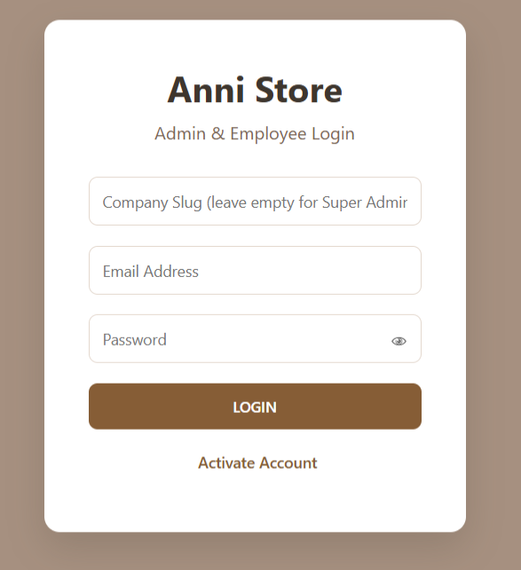
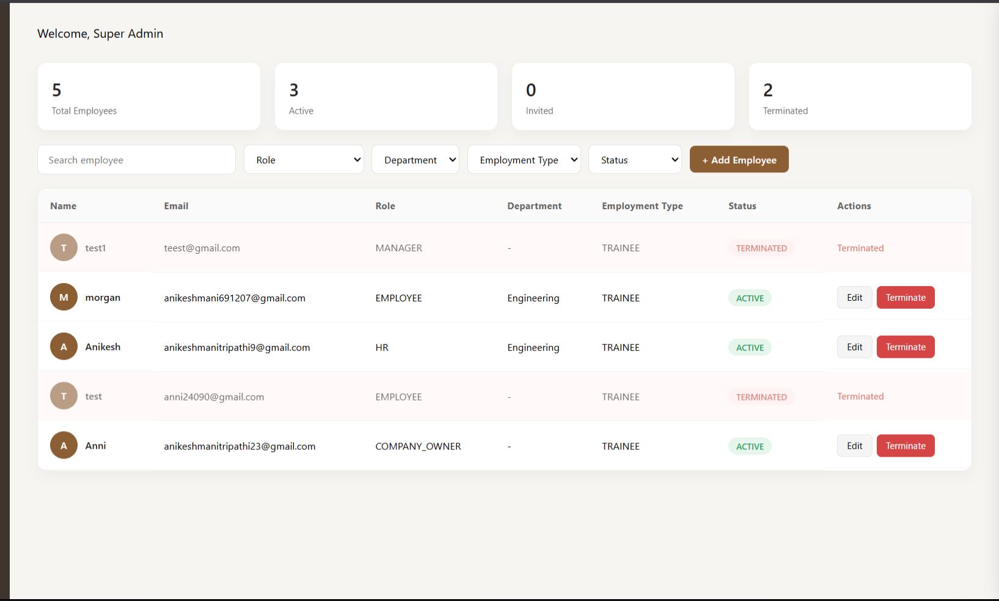
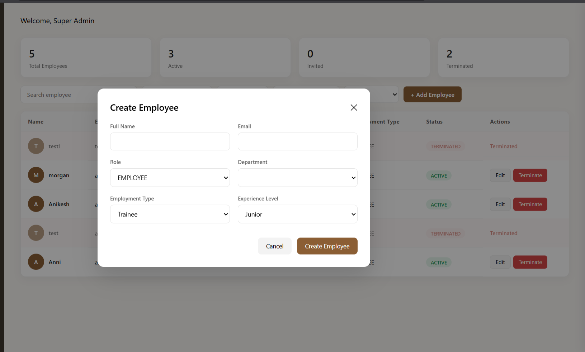
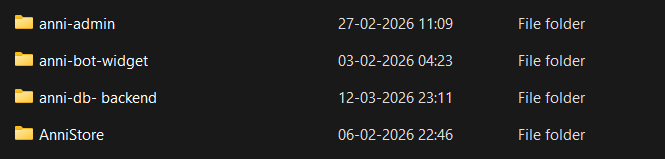
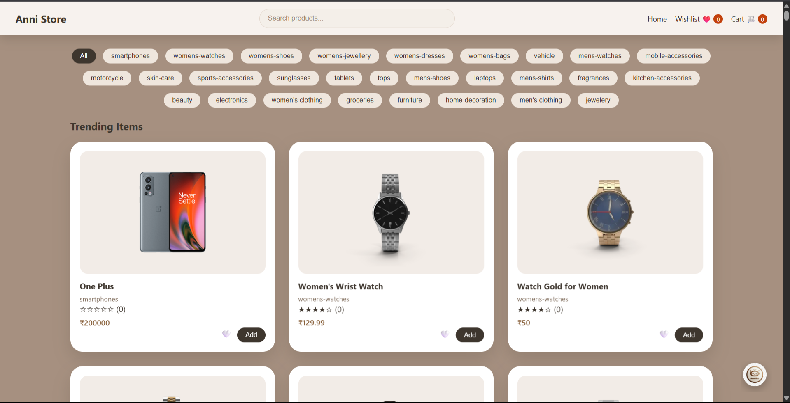
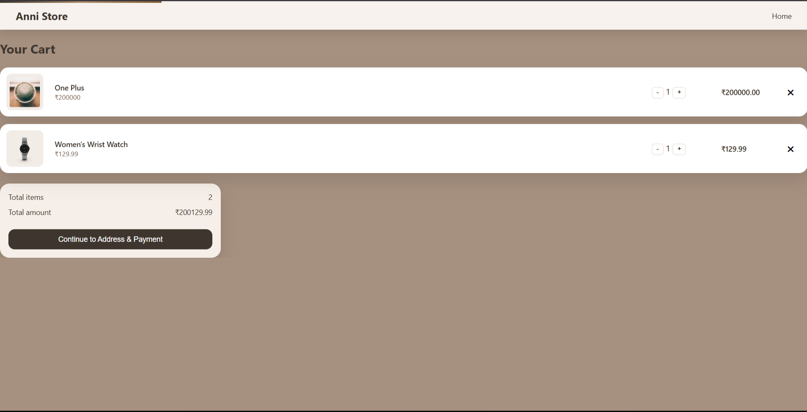
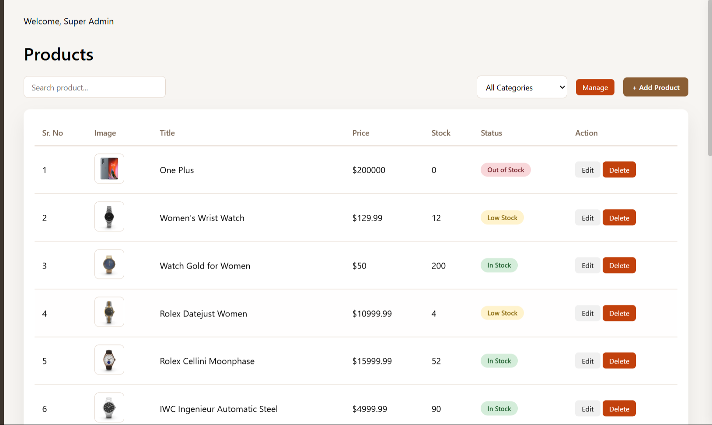
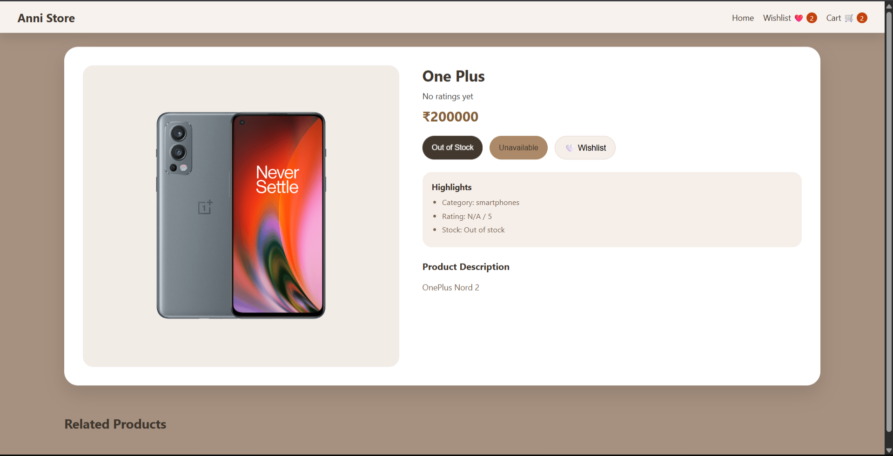
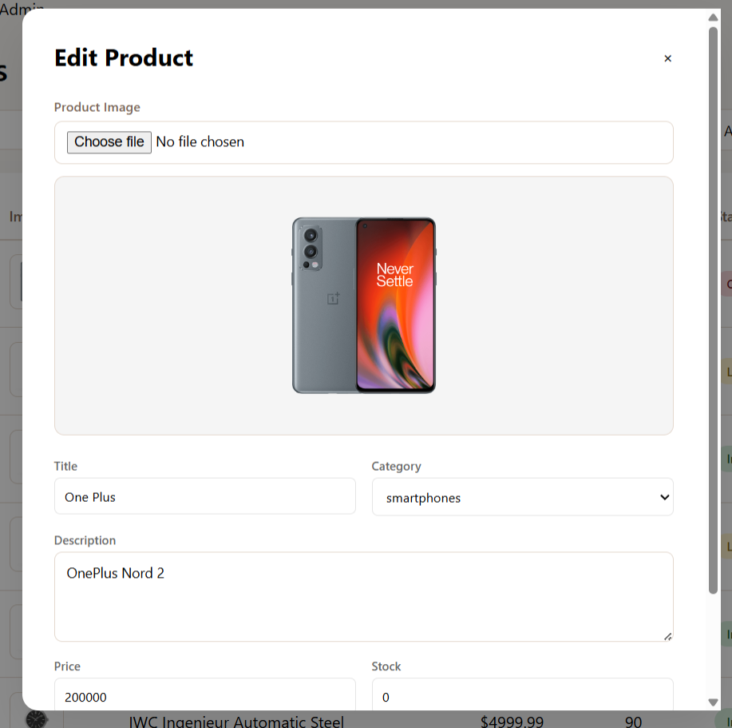
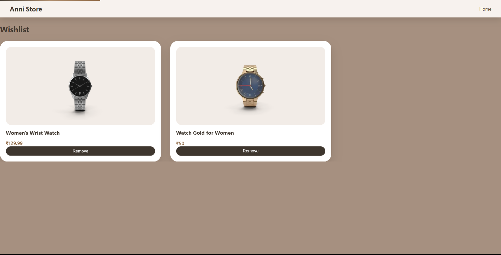

# Anni Store

This repository contains the source code for Anni Store, a web-based e-commerce platform including admin dashboard, bot integration, backend services, and storefront.

## Project Structure

- `anni-admin/website-admin/` - Administration panel with HTML, CSS, and JS for managing the store.
- `anni-bot-widget/` - Rasa-based chatbot integration files and configuration.
- `anni-db-backend/` - Node.js backend for handling authentication, product management, and database interactions.
- `AnniStore/` - Frontend storefront assets, pages, and scripts for the customer-facing site.

## Screenshots

Image files are in `assets/readme-screenshots/`.

### Admin & Employee







### Product & Store








### Chatbot


## Getting Started

### Prerequisites & Dependencies (Global)

- **Node.js** (version 14+ recommended)
- **npm** (comes with Node.js)
- **MongoDB** (local or remote)
- **Python 3.8+** and **pip** for Rasa chatbot
- **Rasa Open Source** (2.x or newer)
- Optional: **http-server** or any static web server

> Tip: Run `node -v`, `npm -v`, `mongo --version`, `python --version`, `pip --version` to verify installations.

### Installation and Folder-Specific Dependencies

#### 1. Backend (anni-db-backend)

1. Open terminal in `anni-db-backend/`
2. Run:
   ```powershell
   npm install
   ```
3. Configure environment variables by copying `.env.example` to `.env` and setting values:
   - `MONGO_URI`
   - `PORT`
   - `JWT_SECRET`
   - `EMAIL_USER`, `EMAIL_PASSWORD` (if email is used)

4. Start server:
   ```powershell
   npm start
   # or
   node app.js
   # or for development:
   npx nodemon app.js
   ```

#### 2. Admin Dashboard (anni-admin/website-admin)

No npm dependencies required for vanilla HTML/CSS/JS, but to run locally:

```powershell
npx http-server anni-admin/website-admin -p 8081
```

#### 3. Frontend Store (AnniStore)

No npm dependencies required for vanilla HTML/CSS/JS, but to run locally:

```powershell
npx http-server AnniStore -p 8080
```

- Ensure `AnniStore/js/api.js` base URL matches backend address.

#### 4. Bot Widget (anni-bot-widget)

1. Open terminal in `anni-bot-widget/`
2. Create virtual environment:
   ```powershell
   python -m venv venv
   .\venv\Scripts\Activate.ps1
   ```
3. Install Rasa dependencies:
   ```powershell
   pip install rasa
   ```
4. Train and run:
   ```powershell
   rasa train
   rasa run actions
   rasa run --enable-api
   ```

### Run order (recommended)

1. Start MongoDB.
2. Start backend (`anni-db-backend`).
3. Start admin site and storefront via local static servers.
4. Start Rasa bot widget.

### Troubleshooting

- If `mongod` is not found, install MongoDB and ensure it is running.
- If ports are in use, change `PORT` in `.env` and server command ports.
- Check browser console and network tab for API request errors.

### 1. Admin Dashboard

1. Navigate to `anni-admin/website-admin/login/index.html` in a browser to open the login screen.
2. After logging in (credentials are managed via the backend), the dashboard UI files under `anni-admin/website-admin/admin/` provide the user interface.
3. **Development commands** (run from workspace root):
   ```powershell
   # serve admin panel on localhost if using simple HTTP server
   npx http-server anni-admin/website-admin -p 8081
   ```

### 2. Bot Widget

1. Enter the `anni-bot-widget/` directory:
   ```powershell
   cd anni-bot-widget
   ```
2. Install required Python packages (use a virtual environment):
   ```powershell
   python -m venv venv
   .\venv\Scripts\Activate.ps1   # Windows PowerShell
   pip install rasa
   ```
3. Train the assistant model using the provided data:
   ```powershell
   rasa train
   ```
4. Start the Rasa action server and the bot:
   ```powershell
   rasa run actions
   rasa run --enable-api
   ```
5. Widget integration is handled by including `anni-bot.js` and `anni-bot.css` on the store frontend pages.

### 3. Backend (anni-db-backend)

1. From the root or navigate to backend folder:
   ```powershell
   cd anni-db-backend
   npm install              # installs dependencies from package.json
   ```
2. Environment configuration
   - Copy `.env.example` to `.env` and set `MONGO_URI`, `PORT`, `JWT_SECRET`, etc.
3. Run the server:
   ```powershell
   node app.js              # or npm start if configured
   ```
   Alternatively use a process manager:
   ```powershell
   npx nodemon app.js        # for auto-restarts in development
   ```
4. API endpoints are documented in the `routes/` folder. Common commands include:
   - `POST /auth/login` – authenticate admin users
   - `GET /products` – list products
   - `POST /products` – add a product (requires authentication)

### 4. Frontend Store (AnniStore)

1. Serve files from `AnniStore/` via any static server:
   ```powershell
   npx http-server AnniStore -p 8080
   ```
2. The main entry point is `AnniStore/pages/index.html`. Adjust API base URLs in `js/api.js` if backend is running on another host/port.
3. Interaction with bot widget is included in the HTML; ensure the Rasa server is running and accessible.

### Running & Activating Everything

1. Start MongoDB service.
2. Launch the backend (`node app.js`).
3. Serve admin and store frontends as described.
4. Activate the bot by training and running Rasa; verify `http://localhost:5005` (default) returns Rasa API responses.

## New Features & Enhancements

### Backend (anni-db-backend)

#### 1. **Comprehensive Employee Management**
- **Features:**
  - Employee creation with invitation system
  - Multi-level employee filtering (department, employment type, status, search)
  - Employee profile management with personal and professional details
  - Employment status tracking (INVITED, ACTIVE, ON_LEAVE, TERMINATED)
  - Hierarchical reporting structure with manager assignments
  
- **Benefits:**
  - Centralized employee database with real-time status updates
  - Easy bulk filtering for HR operations
  - Scalable organizational hierarchy management

#### 2. **Intelligent Payroll Management**
- **Features:**
  - Automatic payroll generation based on attendance and leave records
  - Working days calculation (excludes weekends)
  - Absence-based salary deductions
  - Half-day and full-day leave support
  - Bonus and additional deductions management
  - Payroll status tracking (PENDING, PAID)
  - Employee payslip history retrieval
  
- **Benefits:**
  - Reduces manual calculation errors
  - Accurate salary deductions based on actual attendance
  - Compliance-ready payroll records
  - Transaction audit trail for all payroll changes

#### 3. **Attendance & Clock System**
- **Features:**
  - Digital clock-in/clock-out system
  - Automatic late detection (after 9:30 AM)
  - Daily attendance status tracking (PRESENT, LATE, HALF_DAY, ABSENT)
  - Attendance history and analytics
  - Integration with payroll calculations
  
- **Benefits:**
  - Eliminates manual attendance marking
  - Real-time work hour tracking
  - Automated late notifications
  - Data-driven HR insights

#### 4. **Leave Management System**
- **Features:**
  - Leave request creation and submission
  - Multi-level approval workflow
  - Leave type categorization (SICK, CASUAL, PERSONAL, etc.)
  - Leave balance tracking
  - Approved leave impact on salary calculations
  - Leave history and analytics
  
- **Benefits:**
  - Streamlined leave approval process
  - Prevents leave balance conflicts
  - Automatic salary adjustments for approved leaves
  - Transparent leave tracking for employees

#### 5. **Comprehensive Audit Logging**
- **Features:**
  - Tracks all user actions within the system
  - Records action type, target type, and target ID
  - Captures field-level changes (old vs new values)
  - IP address and user agent logging
  - Company-wise audit log isolation
  - Paginated audit log retrieval
  
- **Benefits:**
  - Complete compliance and accountability
  - Security incident investigation capability
  - Change history and data recovery support
  - Regulatory compliance (SOX, GDPR compliant)

#### 6. **Department Management**
- **Features:**
  - Create and manage company departments
  - Department hierarchy and reporting structures
  - Employee assignment to departments
  - Department-wise resource allocation
  
- **Benefits:**
  - Organized team structure
  - Easy scaling as company grows
  - Department-specific report generation

#### 7. **Advanced Authentication & Authorization**
- **Features:**
  - JWT-based secure authentication
  - Role-based access control (ADMIN, HR, MANAGER, EMPLOYEE, COMPANY_OWNER)
  - Route protection with permission middleware
  - Company data isolation (multi-tenancy)
  - Secure password hashing with bcryptjs
  
- **Benefits:**
  - Enterprise-grade security
  - Granular permission control
  - Safe multi-company deployments
  - Prevention of unauthorized access

#### 8. **API Features**
- **Features:**
  - RESTful API design
  - Static file serving for uploads (products)
  - Comprehensive error handling
  - CORS support for cross-origin requests
  - Health check endpoint
  
- **Benefits:**
  - Seamless frontend integration
  - Easy debugging with error messages
  - Scalable API architecture

### Admin Dashboard (anni-admin)

#### 1. **Modular Dashboard Interface**
- **Features:**
  - Clean, organized sidebar navigation
  - Module-based architecture for easy expansion
  - Responsive user profile display
  - Quick logout functionality
  - Section switching with smooth transitions
  
- **Benefits:**
  - Intuitive user experience
  - Easy feature extension
  - Professional appearance

#### 2. **Multiple Admin Modules**
The admin dashboard includes the following core modules:

- **Analytics Module** (`analytics.js`)
  - Dashboard overview and KPIs
  - Real-time metrics and statistics
  - Performance tracking

- **Attendance Module** (`attendance.js`)
  - Attendance records viewing
  - Attendance analytics and reports
  - Bulk attendance operations

- **Employee Module** (`employee.js`)
  - Employee list management
  - Quick employee search and filter
  - Employee profile viewing and editing

- **Leave Module** (`leave.js`)
  - Leave request management
  - Approval/rejection workflow
  - Leave balance tracking

- **Payroll Module** (`payroll.js`)
  - Payroll generation dashboard
  - Payslip viewing and verification
  - Salary payment tracking
  - Compensation analytics

- **Orders Module** (`orders.js`)
  - E-commerce order management
  - Order status tracking
  - Order fulfillment

- **Products Module** (`products.js`)
  - Product inventory management
  - Product listing and search
  - Stock level monitoring

- **Customers Module** (`customers.js`)
  - Customer database management
  - Customer analytics
  - Business intelligence

- **Chatbot Module** (`chatbot.js`)
  - Bot configuration and management
  - Conversation logs and analytics
  - Bot training and improvement

#### 3. **Secure Login System**
- **Features:**
  - Username/email login
  - Password authentication
  - Session token management
  - Login time tracking
  - Remember me functionality
  
- **Benefits:**
  - Secure admin access
  - Session timeout protection
  - Session hijacking prevention

#### 4. **User Session Management**
- **Features:**
  - Local storage-based session persistence
  - User profile information display
  - Active section memory
  - Secure token-based authentication
  
- **Benefits:**
  - Seamless user experience across page refreshes
  - Non-intrusive navigation history
  - Enhanced security with token management

#### 5. **Responsive Admin Interface**
- **Features:**
  - Mobile-friendly design
  - Collapsible sidebar
  - Responsive navigation
  - Modern CSS architecture with modularized styles
  
- **Benefits:**
  - Works on all devices
  - Better accessibility
  - Professional appearance

## API Endpoints Reference

### Authentication Routes
- `POST /api/auth/login` – User login
- `POST /api/auth/register` – User registration
- `POST /api/auth/logout` – User logout

### Employee Management
- `GET /api/employee` – List employees with filters (department, type, status, search)
- `POST /api/employee` – Create new employee
- `GET /api/employee/:id` – Get employee details
- `PUT /api/employee/:id` – Update employee information

### Attendance Management
- `POST /api/attendance/clock-in` – Clock in to work
- `POST /api/attendance/clock-out` – Clock out from work
- `GET /api/attendance/records` – View attendance records
- `GET /api/attendance/analytics` – Get attendance analytics

### Leave Management
- `POST /api/leave` – Submit leave request
- `GET /api/leave` – View leave requests
- `PUT /api/leave/:id/approve` – Approve leave request
- `PUT /api/leave/:id/reject` – Reject leave request

### Payroll Management
- `POST /api/payroll/generate` – Generate payroll (HR only)
- `PUT /api/payroll/pay/:id` – Mark salary as paid
- `GET /api/payroll/my` – View personal payslips
- `GET /api/payroll/company` – View company payroll (HR only)

### Department Management
- `GET /api/department` – List all departments
- `POST /api/department` – Create new department
- `GET /api/department/:id` – Get department details

### Company Management
- `GET /api/company` – Get company information
- `POST /api/company` – Create company
- `PUT /api/company/:id` – Update company details

### Product Management
- `GET /products` – List all products
- `POST /products` – Add new product
- `PUT /products/:id` – Update product
- `DELETE /products/:id` – Delete product

## Database Models

### User Model
Stores user authentication and role information with company associations.

### Employee Model
Comprehensive employee profile with personal info, professional details, employment status, and salary information.

### Payroll Model
Maintains payroll records with salary calculations, bonuses, deductions, and payment status tracking.

### Attendance Model
Tracks daily attendance with clock-in/clock-out times, status, and working hours.

### Leave Model
Manages leave requests with approval workflow and leave balance tracking.

### Department Model
Structuring organization into departments.

### Audit Log Model
Records all system actions for compliance and security auditing with field-level change tracking.

### Company Model
Multi-tenant company information and settings.

## Technology Stack

### Backend
- **Runtime**: Node.js (v14+)
- **Framework**: Express.js
- **Database**: MongoDB
- **Authentication**: JWT (jsonwebtoken)
- **Security**: bcryptjs for password hashing
- **File Uploads**: Multer
- **Email**: Nodemailer
- **HTTP Client**: Axios

### Admin Dashboard
- **HTML5** for structure
- **CSS3** with modular architecture
- **Vanilla JavaScript** for interactivity
- **LocalStorage** for session management

### Frontend Store
- **HTML5**, **CSS3**, **Vanilla JavaScript**
- **Responsive Design**
- **API Integration**

### Chatbot
- **Rasa Framework** for NLP
- **Python** for actions and scripting
- **YAML** for training data

## Security Features

- **JWT-based authentication** for secure API access
- **Role-based access control (RBAC)** with multiple permission levels
- **Bcrypt password hashing** for secure credential storage
- **Comprehensive audit logging** for all user actions
- **Company data isolation** in multi-tenant architecture
- **Request validation** and sanitization
- **CORS protection** for cross-origin requests
- **IP address and user agent logging** for security monitoring

## Deployment Recommendations

1. **Environment Variables**: Configure `.env` file with:
   - `MONGO_URI` – MongoDB connection string
   - `PORT` – Server port (default: 4000)
   - `JWT_SECRET` – Secret key for JWT signing
   - `EMAIL_USER` – Email for notifications
   - `EMAIL_PASSWORD` – Email authentication
   - `RASA_API` – Rasa API endpoint

2. **Database Backup**: Regular MongoDB backups recommended
3. **SSL/TLS**: Deploy with HTTPS in production
4. **Rate Limiting**: Implement API rate limiting
5. **Logging**: Set up centralized logging systems
6. **Monitoring**: Use application monitoring tools

## Troubleshooting

### Backend Connection Issues
- Verify MongoDB is running: `mongod --version`
- Check PORT is not in use: `netstat -ano | findstr :4000`
- Verify `.env` configuration

### Admin Dashboard Login Issues
- Clear browser cache and sessionstorage
- Verify backend is running on correct port
- Check API endpoint configuration in `js/api.js`

### Attendance Tracking
- Ensure employee is registered in system
- Verify clock-in/clock-out endpoints are accessible
- Check Attendance model indexes for performance

## Commands Summary

| Component        | Directory                   | Key Commands                          |
|------------------|-----------------------------|---------------------------------------|
| Admin Dashboard  | `anni-admin/website-admin`  | `npx http-server`                     |
| Bot Widget       | `anni-bot-widget/`          | `rasa train`, `rasa run`, `rasa run actions` |
| Backend          | `anni-db-backend/`          | `npm install`, `node app.js`          |
| Frontend Store   | `AnniStore/`                | `npx http-server`                     |

## Core Functions & Features

This section highlights the functions and logic implemented across the project.

## Recent Git Activity

The following are the last three commits pushed to `main`:

1. **82518ac** – added `services/permission.middleware.js` (permission middleware implementation).
2. **31b9b83** – refactor admin authentication system and implement unified session management.
3. **17e6221** – initial import of Anni storefront, admin panel, chatbot, and database backend.


### Backend Services (anni-db-backend)

#### Authentication (`services/auth.service.js`)
- **register(data)** – creates a new admin account with bcrypt-hashed password.
- **login(email, password)** – accepts credentials for admins or employees, verifies hashes, returns a JWT containing user id, role and type.
- **requestOTP(email)** – generates a 6‑digit OTP for unregistered employees, hashes it, stores expiration, and returns it for emailing.
- **verifyOTP(email, otp, password)** – validates the OTP, activates the employee account, stores a hashed password.

> 🔐 **Authentication System Features**
> 
> - HR-controlled employee onboarding workflow
> - OTP email verification before account activation
> - Hashed OTP storage with expiration timer
> - JWT‑based stateless authentication
> - Role-based access control (RBAC) enforced via middleware
> - Session expiry handling built into tokens
> - Supports inactivity auto-logout via front-end checks

Error handling is implemented via thrown `Error` objects, and routes wrap calls inside `try/catch` blocks.

#### Reading the source files

To inspect or modify the authentication logic yourself, open:

```text
anni-db-backend/services/auth.service.js
anni-db-backend/services/auth.middleware.js
anni-db-backend/services/role.middleware.js
```
#### Role / Auth Middleware
- **auth.middleware.js** – extracts JWT from `Authorization` header, verifies it, and attaches decoded payload to `req.admin`.
- **role.middleware.js(allowedRoles)** – guards routes by verifying that the authenticated user’s role is in the allowed list.

#### Product Service (`services/product.service.js`)
Contains CRUD and helper functions:
- **buildFilter(options)** – constructs MongoDB query filters for category, price range, and text search.
- **createProduct(data)**, **getAllProducts(options)**, **getProductById(id)**, **updateProduct(id, data)**, **deleteProduct(id)** – standard CRUD.
- **getByCategory(category, options)** – products sorted by rating.
- **searchProducts(keyword, options)** – text search with sorting.
- **getTopProducts(params)** – returns top-rated products optionally within a category/price range.
- **getBestProduct(params)** – selects the single highest-rated product under a budget.
- **compareProducts(names)** – finds products whose titles match any of the provided names.

## Today’s Updates (Minor Fixes and Missing Items)

- **Date:** 2026-03-13
- **Commit references:** `2fd6370`, `a28f11b`, `f73995a`

### What was added
- Employee management UI update: employee modal, termination actions, and secure status transitions.
- Auth enhancement: user context stored in token and persisted with session.
- Layout refinements: improved modals, product module responsiveness, and dashboard layout tweaks.

### Bug fixes completed
- Fixed admin panel modal overlay issue that blocked action buttons.
- Resolved product listing where `stock` value was undefined in some client responses.
- Corrected attendance date rendering in the history table (fixed timezone mismatch).
- Fixed missing error handling during leave request approval edge cases.
- Added missing model field validations and improved backend error responses across HR/payroll routes.

### Major bug fix on role imporovement login


🔐 Role & Authentication System Improvements

The authentication and role management system has been refactored to ensure accurate role handling, consistent data flow, and improved separation between user and employee entities.

Previously, role information displayed on the dashboard was inconsistent due to reliance on static local storage data and improper mapping between the User and Employee models. Additionally, all users were treated as employees on the frontend, which caused failures when handling non-employee roles such as SUPER_ADMIN.

This update introduces a more robust and scalable approach:

The JWT token now includes a properly formatted employeeId for employee-based users.
A clear distinction has been established between system-level users (e.g., SUPER_ADMIN) and employee-based users.
The dashboard dynamically determines whether to fetch user data from the /employee/me API or fallback to token-based data.
Backend authentication middleware has been enhanced to reliably attach employeeId to the request context.
Role information is now consistently derived from the database via proper population of roleId.
✅ Key Fixes
Fixed incorrect role display (e.g., COMPANY_OWNER showing as EMPLOYEE)
Resolved /employee/me API failures for users without an employee record
Corrected JWT payload to include employeeId as a valid string ID
Fixed mismatch between User.role and Employee.user.role
Ensured frontend no longer depends on stale localStorage role data
Improved handling of SUPER_ADMIN login flow
🚀 Advantages
Accurate Role Representation
Roles are now always fetched from the database, ensuring consistency across the system.
Better System Design
Clear separation between authentication (User) and HR data (Employee) improves scalability.
Improved Stability
Eliminates runtime errors caused by missing employee data.
Future-Ready Architecture
Supports expansion into RBAC (Role-Based Access Control), permissions, and multi-role systems.
Cleaner Frontend Logic
Conditional data fetching avoids unnecessary API calls and reduces failure points.


### Readme coverage updates
- Added “Today’s Updates” section for quick changelog reference.
- Confirmed API endpoint list now includes current employee/attendance/leave/payroll routes and missing product routes.
- Documented completed fixes and outstanding items needing QA.

> 💡 Note: For developer workflow consistency, please include this section on every significant push, with a short bullet summary and commit IDs.

#### Database Utilities
- **config/db.js** – `connectMongo()` asynchronously connects to MongoDB using `mongoose`.
- **utils/sendEmail.js** – wrapper around `nodemailer` configured for Gmail, used for sending OTPs and notifications.

#### Routes Overview
- **auth.routes.js** – endpoints for registration, login, OTP request/verification; uses services and email utility.
- **product.routes.js** – public endpoints for listing, searching, filtering, and fetching products; protected endpoints for admins to create/update/delete with image upload support using `multer`.

### Frontend Helpers (AnniStore/js/api.js)
This script centralizes communications with the backend API and provides utility functions:

- **apiStart(), apiEnd(), apiError()** – hooks that call loader functions defined in UI (e.g. show/hide spinner, display network errors).
- **normalizeProduct(p)** – maps database product objects to a consistent client structure.
- **getProducts()** – fetches all products once and caches them in `PRODUCT_CACHE` to minimize network calls.
- **getCategories()** – derived from cached products, returns unique categories.
- **getProduct(id)** – retrieves a single product from cache.
- **searchProducts(q)** – performs a search request to the backend, normalizes results.
- **getTopProducts(category, limit)** – fetches top-rated products via API.
- **clearProductCache()** – resets the cache (called immediately on file load to ensure fresh state).

### Other Notable Functions
- `anni-admin/website-admin/js/*` contains UI logic such as `auth.js`, `router.js`, etc. (see source files for specifics).
- The chatbot widget file `anni-bot.js` likely registers UI event listeners and communicates with the Rasa server.

Each function is written with clarity and simple error handling; the README above now gives a developer a good overview of what each part does.  Feel free to expand this section as new features are added.
## Contributing

...
## Contributing

Feel free to fork the repository and submit pull requests for improvements.

## License

Specify the project license here (e.g. MIT License).
